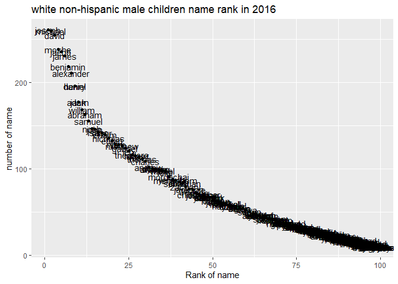

p8105\_hw2\_jl6048
================
Jinghan Liu

``` r
library(tidyverse)
```

    ## -- Attaching packages --------------------------------------- tidyverse 1.3.1 --

    ## v ggplot2 3.3.5     v purrr   0.3.4
    ## v tibble  3.1.4     v dplyr   1.0.7
    ## v tidyr   1.1.3     v stringr 1.4.0
    ## v readr   2.0.1     v forcats 0.5.1

    ## -- Conflicts ------------------------------------------ tidyverse_conflicts() --
    ## x dplyr::filter() masks stats::filter()
    ## x dplyr::lag()    masks stats::lag()

``` r
library(readxl)
library(lubridate)
```

    ## 
    ## Attaching package: 'lubridate'

    ## The following objects are masked from 'package:base':
    ## 
    ##     date, intersect, setdiff, union

## Problem 1a

\#Read and clean the Mr. Trash Wheel sheet

``` r
Trash_df = 
  read_excel("Trash-Wheel-Collection-Totals-7-2020-2.xlsx", sheet = "Mr. Trash Wheel" ,range ="A2:N535") %>%
  janitor::clean_names() %>%
  drop_na(dumpster,month) %>%
  mutate(sports_balls = round(sports_balls)) 
Trash_df
```

    ## # A tibble: 453 x 14
    ##    dumpster month  year date                weight_tons volume_cubic_yards
    ##    <chr>    <chr> <dbl> <dttm>                    <dbl>              <dbl>
    ##  1 1        May    2014 2014-05-16 00:00:00        4.31                 18
    ##  2 2        May    2014 2014-05-16 00:00:00        2.74                 13
    ##  3 3        May    2014 2014-05-16 00:00:00        3.45                 15
    ##  4 4        May    2014 2014-05-17 00:00:00        3.1                  15
    ##  5 5        May    2014 2014-05-17 00:00:00        4.06                 18
    ##  6 6        May    2014 2014-05-20 00:00:00        2.71                 13
    ##  7 7        May    2014 2014-05-21 00:00:00        1.91                  8
    ##  8 8        May    2014 2014-05-28 00:00:00        3.7                  16
    ##  9 9        June   2014 2014-06-05 00:00:00        2.52                 14
    ## 10 10       June   2014 2014-06-11 00:00:00        3.76                 18
    ## # ... with 443 more rows, and 8 more variables: plastic_bottles <dbl>,
    ## #   polystyrene <dbl>, cigarette_butts <dbl>, glass_bottles <dbl>,
    ## #   grocery_bags <dbl>, chip_bags <dbl>, sports_balls <dbl>,
    ## #   homes_powered <dbl>

## Problem 1b

\#Read and clean precipitation data for 2018 and 2019

``` r
data2019_df = 
  read_excel("Trash-Wheel-Collection-Totals-7-2020-2.xlsx", sheet = "2019 Precipitation" ,range ="A2:B14") %>%
  janitor::clean_names() %>%
  mutate(year = 2019)
data2019_df
```

    ## # A tibble: 12 x 3
    ##    month total  year
    ##    <dbl> <dbl> <dbl>
    ##  1     1  3.1   2019
    ##  2     2  3.64  2019
    ##  3     3  4.47  2019
    ##  4     4  1.46  2019
    ##  5     5  3.58  2019
    ##  6     6  0.42  2019
    ##  7     7  3.85  2019
    ##  8     8  2.39  2019
    ##  9     9  0.16  2019
    ## 10    10  5.45  2019
    ## 11    11  1.86  2019
    ## 12    12  3.57  2019

``` r
data2018_df = 
  read_excel("Trash-Wheel-Collection-Totals-7-2020-2.xlsx", sheet = "2018 Precipitation" ,range ="A2:B14") %>%
  janitor::clean_names() %>%
  mutate(year = 2018) 
data2018_df
```

    ## # A tibble: 12 x 3
    ##    month total  year
    ##    <dbl> <dbl> <dbl>
    ##  1     1  0.94  2018
    ##  2     2  4.8   2018
    ##  3     3  2.69  2018
    ##  4     4  4.69  2018
    ##  5     5  9.27  2018
    ##  6     6  4.77  2018
    ##  7     7 10.2   2018
    ##  8     8  6.45  2018
    ##  9     9 10.5   2018
    ## 10    10  2.12  2018
    ## 11    11  7.82  2018
    ## 12    12  6.11  2018

\#combine precipitation datasets

``` r
data_df =
  bind_rows(data2019_df, data2018_df)%>%
  mutate(month = month.name[month])
data_df
```

    ## # A tibble: 24 x 3
    ##    month     total  year
    ##    <chr>     <dbl> <dbl>
    ##  1 January    3.1   2019
    ##  2 February   3.64  2019
    ##  3 March      4.47  2019
    ##  4 April      1.46  2019
    ##  5 May        3.58  2019
    ##  6 June       0.42  2019
    ##  7 July       3.85  2019
    ##  8 August     2.39  2019
    ##  9 September  0.16  2019
    ## 10 October    5.45  2019
    ## # ... with 14 more rows

\#description

The number of obervations in Trash wheel dateset is 453 obsevations and
the varialbles are 14 variables. The key variables for trash
measurements are weight\_tons

The number of obervations in combined precipitation dateset is 24
obsevations and the varialbles are 3 variables. The total precipitation
in 2018 was70.33 inches The median number of sports balls in a dumpster
in 2019 was9

## Problem 2

\#pols dataset read and tidy

``` r
pols_df = 
  read_csv("data/pols-month.csv") %>%
  janitor::clean_names() %>%
  separate(mon, into = c("year", "month", "day"), convert = TRUE) %>%
  mutate(month = month.abb[month])
pols_df
```

    ## # A tibble: 822 x 11
    ##     year month   day prez_gop gov_gop sen_gop rep_gop prez_dem gov_dem sen_dem
    ##    <int> <chr> <int>    <dbl>   <dbl>   <dbl>   <dbl>    <dbl>   <dbl>   <dbl>
    ##  1  1947 Jan      15        0      23      51     253        1      23      45
    ##  2  1947 Feb      15        0      23      51     253        1      23      45
    ##  3  1947 Mar      15        0      23      51     253        1      23      45
    ##  4  1947 Apr      15        0      23      51     253        1      23      45
    ##  5  1947 May      15        0      23      51     253        1      23      45
    ##  6  1947 Jun      15        0      23      51     253        1      23      45
    ##  7  1947 Jul      15        0      23      51     253        1      23      45
    ##  8  1947 Aug      15        0      23      51     253        1      23      45
    ##  9  1947 Sep      15        0      23      51     253        1      23      45
    ## 10  1947 Oct      15        0      23      51     253        1      23      45
    ## # ... with 812 more rows, and 1 more variable: rep_dem <dbl>

``` r
pols_tidy =
  pols_df %>%
  pivot_longer(
    c(prez_gop, prez_dem),
    names_to = "president",
    names_prefix = "prez_",
    values_to = "dbi") %>%
    select(-day) %>%
  filter(dbi != 0) %>%
    select(-dbi)
pols_tidy
```

    ## # A tibble: 822 x 9
    ##     year month gov_gop sen_gop rep_gop gov_dem sen_dem rep_dem president
    ##    <int> <chr>   <dbl>   <dbl>   <dbl>   <dbl>   <dbl>   <dbl> <chr>    
    ##  1  1947 Jan        23      51     253      23      45     198 dem      
    ##  2  1947 Feb        23      51     253      23      45     198 dem      
    ##  3  1947 Mar        23      51     253      23      45     198 dem      
    ##  4  1947 Apr        23      51     253      23      45     198 dem      
    ##  5  1947 May        23      51     253      23      45     198 dem      
    ##  6  1947 Jun        23      51     253      23      45     198 dem      
    ##  7  1947 Jul        23      51     253      23      45     198 dem      
    ##  8  1947 Aug        23      51     253      23      45     198 dem      
    ##  9  1947 Sep        23      51     253      23      45     198 dem      
    ## 10  1947 Oct        23      51     253      23      45     198 dem      
    ## # ... with 812 more rows

\#snp dataset read and tidy

``` r
snp_df = 
  read_csv("data/snp.csv") %>%
  janitor::clean_names() %>%
  separate(date, into = c("month","day","year"), convert = TRUE)%>%
   mutate(
     year = ifelse(year<= 15, year + 2000, year + 1900),
     month = month.abb[month]) %>%
  select(year, month, close)
snp_df
```

    ## # A tibble: 787 x 3
    ##     year month close
    ##    <dbl> <chr> <dbl>
    ##  1  2015 Jul   2080.
    ##  2  2015 Jun   2063.
    ##  3  2015 May   2107.
    ##  4  2015 Apr   2086.
    ##  5  2015 Mar   2068.
    ##  6  2015 Feb   2104.
    ##  7  2015 Jan   1995.
    ##  8  2014 Dec   2059.
    ##  9  2014 Nov   2068.
    ## 10  2014 Oct   2018.
    ## # ... with 777 more rows

\#unemployment dataset read and tidy

``` r
une_df = 
  read_csv("data/unemployment.csv") %>%
  pivot_longer(
    Jan:Dec,
    names_to = "month",
    values_to = "unemployment")%>%
  janitor::clean_names() 
une_df
```

    ## # A tibble: 816 x 3
    ##     year month unemployment
    ##    <dbl> <chr>        <dbl>
    ##  1  1948 Jan            3.4
    ##  2  1948 Feb            3.8
    ##  3  1948 Mar            4  
    ##  4  1948 Apr            3.9
    ##  5  1948 May            3.5
    ##  6  1948 Jun            3.6
    ##  7  1948 Jul            3.6
    ##  8  1948 Aug            3.9
    ##  9  1948 Sep            3.8
    ## 10  1948 Oct            3.7
    ## # ... with 806 more rows

\#merge three datasets

``` r
pols_snp_df =
  full_join(pols_tidy, snp_df)
all_df =
  full_join(pols_snp_df, une_df)
all_df
```

    ## # A tibble: 828 x 11
    ##     year month gov_gop sen_gop rep_gop gov_dem sen_dem rep_dem president close
    ##    <dbl> <chr>   <dbl>   <dbl>   <dbl>   <dbl>   <dbl>   <dbl> <chr>     <dbl>
    ##  1  1947 Jan        23      51     253      23      45     198 dem          NA
    ##  2  1947 Feb        23      51     253      23      45     198 dem          NA
    ##  3  1947 Mar        23      51     253      23      45     198 dem          NA
    ##  4  1947 Apr        23      51     253      23      45     198 dem          NA
    ##  5  1947 May        23      51     253      23      45     198 dem          NA
    ##  6  1947 Jun        23      51     253      23      45     198 dem          NA
    ##  7  1947 Jul        23      51     253      23      45     198 dem          NA
    ##  8  1947 Aug        23      51     253      23      45     198 dem          NA
    ##  9  1947 Sep        23      51     253      23      45     198 dem          NA
    ## 10  1947 Oct        23      51     253      23      45     198 dem          NA
    ## # ... with 818 more rows, and 1 more variable: unemployment <dbl>

\#description

The pols-months dataset have 822 observations and 9 variables. This data
contains 1947-2015 years national politicians and in the column of
President, “dem” means democratic and “gop” means republican.

The snp dataset have 787 observations and 3 variables. This data
contains the closing values of the standard & poor’s stock index in
1950-2015. The largest closing value was2107.389893 and the smallest
closing value was 17.049999

The unemployment dataset have 816 observations and 3 variables. This
dataset contains unemplyment percentage from 1948 to 2015.

## Problem 3

\#remove duplicate rows

``` r
pbn_df = 
  read_csv("Popular_Baby_Names.csv") %>%
  janitor::clean_names() %>%
  mutate( gender = str_to_lower(gender), 
          childs_first_name = str_to_lower(childs_first_name),
          ethnicity = str_to_lower(ethnicity),  
          ethnicity = recode(ethnicity, "white non hisp" = "white non hispanic", "asian and paci" = "asian and pacific islander", "black non hisp" = "black non hispanic"))%>%
  distinct()
```

    ## Rows: 19418 Columns: 6

    ## -- Column specification --------------------------------------------------------
    ## Delimiter: ","
    ## chr (3): Gender, Ethnicity, Child's First Name
    ## dbl (3): Year of Birth, Count, Rank

    ## 
    ## i Use `spec()` to retrieve the full column specification for this data.
    ## i Specify the column types or set `show_col_types = FALSE` to quiet this message.

``` r
pbn_df
```

    ## # A tibble: 12,181 x 6
    ##    year_of_birth gender ethnicity                  childs_first_name count  rank
    ##            <dbl> <chr>  <chr>                      <chr>             <dbl> <dbl>
    ##  1          2016 female asian and pacific islander olivia              172     1
    ##  2          2016 female asian and pacific islander chloe               112     2
    ##  3          2016 female asian and pacific islander sophia              104     3
    ##  4          2016 female asian and pacific islander emily                99     4
    ##  5          2016 female asian and pacific islander emma                 99     4
    ##  6          2016 female asian and pacific islander mia                  79     5
    ##  7          2016 female asian and pacific islander charlotte            59     6
    ##  8          2016 female asian and pacific islander sarah                57     7
    ##  9          2016 female asian and pacific islander isabella             56     8
    ## 10          2016 female asian and pacific islander hannah               56     8
    ## # ... with 12,171 more rows

\#Olivia’s table

``` r
olivia_df = 
  filter(pbn_df,
    gender == "female",
    childs_first_name == "olivia") %>%
  select(year_of_birth, ethnicity, rank) %>%
  pivot_wider(
    names_from = "year_of_birth",
    values_from = "rank") %>%
  knitr::kable()
olivia_df
```

| ethnicity                  | 2016 | 2015 | 2014 | 2013 | 2012 | 2011 |
|:---------------------------|-----:|-----:|-----:|-----:|-----:|-----:|
| asian and pacific islander |    1 |    1 |    1 |    3 |    3 |    4 |
| black non hispanic         |    8 |    4 |    8 |    6 |    8 |   10 |
| hispanic                   |   13 |   16 |   16 |   22 |   22 |   18 |
| white non hispanic         |    1 |    1 |    1 |    1 |    4 |    2 |

\#males table

``` r
male_df = 
  filter(pbn_df,
    gender == "male",
    rank == 1) %>%
  select(year_of_birth, ethnicity, childs_first_name) %>%
  pivot_wider(
    names_from = "year_of_birth",
    values_from = "childs_first_name") %>%
  knitr::kable()
male_df
```

| ethnicity                  | 2016   | 2015   | 2014   | 2013   | 2012   | 2011    |
|:---------------------------|:-------|:-------|:-------|:-------|:-------|:--------|
| asian and pacific islander | ethan  | jayden | jayden | jayden | ryan   | ethan   |
| black non hispanic         | noah   | noah   | ethan  | ethan  | jayden | jayden  |
| hispanic                   | liam   | liam   | liam   | jayden | jayden | jayden  |
| white non hispanic         | joseph | david  | joseph | david  | joseph | michael |

# scatter plot

``` r
male_white_2016 =
  filter(pbn_df,
         gender == "male",
         year_of_birth == "2016",
         ethnicity == "white non hispanic")%>%
  ggplot(aes(x = rank, y = count)) +
  geom_point() + 
  geom_text(aes(label = childs_first_name)) +
  labs(title = "white non-hispanic male children name rank in 2016",
       x = "Rank of name",
       y = "number of name")
male_white_2016
```

<!-- -->
